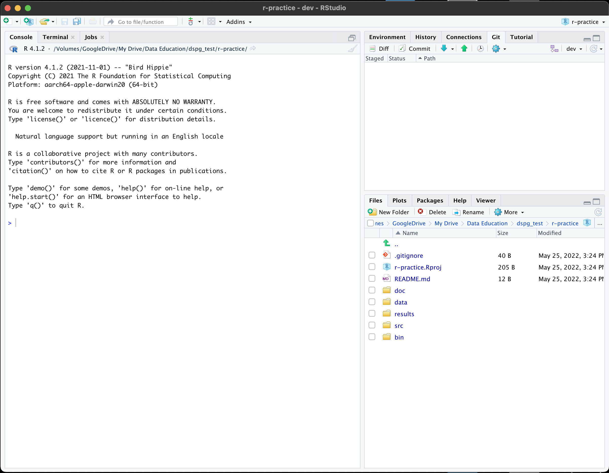

```{r, include=FALSE}
source("../bin/chunk-options.R")
knitr_fig_path("02-")
```

## Introduction

The scientific process is naturally incremental, and many projects
start life as random notes, some code, then a manuscript, and
eventually everything is a bit mixed together.

<blockquote class="twitter-tweet"><p>Managing your projects in a reproducible fashion doesn't just make your science reproducible, it makes your life easier.</p>— Vince Buffalo (@vsbuffalo) <a href="https://twitter.com/vsbuffalo/status/323638476153167872">April 15, 2013</a></blockquote>
<script async src="//platform.twitter.com/widgets.js" charset="utf-8"></script>

Most people tend to organize their projects like this:


There are many reasons why we should *ALWAYS* avoid this:

1. It is really hard to tell which version of your data is
the original and which is the modified;
2. It gets really messy because it mixes files with various
extensions together;
3. It probably takes you a lot of time to actually find
things, and relate the correct figures to the exact code
that has been used to generate it;

A good project layout will ultimately make your life easier:

* It will help ensure the integrity of your data;
* It makes it simpler to share your code with someone else
(a lab-mate, collaborator, or supervisor);
* It allows you to easily upload your code with your manuscript submission;
* It makes it easier to pick the project back up after a break.

## A possible solution

Fortunately, there are tools and packages which can help you manage your work effectively.

One of the most powerful and useful aspects of RStudio is its project management
functionality. We'll be using this today to create a self-contained, reproducible
project. Then, we'll combine that power with Git's version control features to make
a clean, trackable, collaborative environment for your team.


> ## Challenge 1: Clone a Git repository into a project
>
> We're going to create a new project in RStudio staring with an existing Git repository:
>
> 1. Create a New Repository (click "+" then "New Repository" on Github named "r-practice". 
> Make it Public and check the "add a readme" option before clicking "Create".
> 2. In RStudio, click the "File" menu button, then "New Project".
> 3. Click "Version Control" then "Git".
> 4. Copy the URL of your repository on Github.com (it should look like 
> https://github.com/yourusername/projectname) into "Repository URL".
> 5. Select where you'd like to place the project (it will create a new directory within your choice).
> 6. Click the "Create Project" button.
{: .challenge}

The simplest way to open an RStudio project once it has been created is to click
through your file system to get to the directory where it was saved and double
click on the `.Rproj` file. This will open RStudio and start your R session in the
same directory as the `.Rproj` file. All your data, plots and scripts will now be
relative to the project directory. RStudio projects have the added benefit of
allowing you to open multiple projects at the same time each open to its own
project directory. This allows you to keep multiple projects open without them
interfering with each other.

> ## Challenge 2: Opening an RStudio project through the file system
>
>
> 1. Exit RStudio.
> 2. Navigate to the directory where you created a project in Challenge 1.
> 3. Double click on the `.Rproj` file in that directory.
{: .challenge}

## Best practices for project organization

Although there is no "best" way to lay out a project, there are some general
principles to adhere to that will make project management easier:

### Keep the main branch clean

When using Git, the main branch should be reserved for "production" code that is
ready to be shared and used by others. Creating branches related to specific
tasks allows you to debug code for one or more upgrades or additions without
damaging the original codebase's functionality. Once you're ready to commit
your changes to the main branch, use a pull request to merge the changes.

> ## Challenge 3: Authenticate RStudio in Git with SSH
>
> The first step to working with Git in RStudio is to get them talking to each other.
> Git uses SSH to verify identities when creating branches or pushing changes.
> We need to set up SSH in RStudio and Git, then connect them to work successfully.
>
> 1. In RStudio, click `Tools` in the top menu, then click `Global Options`.
> 2. Click `Git/SVN`, then (unless you see an `SSH RSA key`, click `Create RSA Key...`.
> 3. Click `View public key` then copy the key to your clipboard (CTRL-C or CMD-C).
> 4. On Github.com, click your profile picture in the top-right, then `Settings`.
> 5. Click `SSH and GPG keys` then `New SSH key`.
> 6. Paste (CTRL/CMD-V) the key and give it a name like `RStudio` and click `Add SSH key`.
> 7. Switch to the `Terminal` tab in the left RStudio pane.
> 8. Type `ssh -T git@github.com` in the terminal and press enter. You should get a message like:
> `Hi username! You've successfully authenticated, but GitHub does not provide shell access.`
> 9. Type `git config remote.origin.url git@github.com:your_username/your_project.git`
> into the terminal and press enter. You should not see an error (or any message),
> but you should be setup to go!
{: .challenge}

> ## Challenge 4: Create a new branch in your Git repository
>
>
> 1. Click the Git tab on the top-right pane.
> 2. Notice that you are on branch `main`. Click the flowchart symbol to the left
> of `main` to create a new branch.
> 3. Name the branch `dev` (short for development) and click create.
> You should see a status window and may be asked for a passcode if you protected your SSH.
> If you are prompted for your username and password, SSH is not setup correctly yet.
> 4. Close the popup and check that you are now on branch `dev`.
{: .challenge}

### Make small commits with clear messages

It can be easy to forget to commit changes to git for hours or days, but the more changes
you make in a single commit (especially if they're unrelated), the harder it can be to
find what went wrong if you need to change something back. When you switch tasks or reach
a stopping point, make sure to stage and commit changes. It's also important to write
clear, short commit messages that describe the change so you can find it again later.

> ## Challenge 4: Stage, commit, and push changes to a new branch
>
>
> 1. Notice there are two files with `?` status and unstaged changes.
> Check the "Staged box to the left of each to add the changes to Git.
> The status should now show as added (`A`).
> 2. Click commit to open the Git `Review Changes` dialog.
> 3. After checking that the file contents look correct, type the commit message:
`Add R project for practice exercises.` and click `Commit`.
> 4. Close the status window and the review changes window. The files should now be
missing from the Git tab, but there will be a message that your branch is ahead of main.
> 5. Click the green up arrow in the Git pane (`Push Branch`). Close the popup.
> 6. Refresh your repository at github.com. It should now have 2 branches.
> If you click the down arrow by `Main` and switch to `dev` you should see the 2 files.
{: .challenge}

### Treat data as read only

This is probably the most important goal of setting up a project. Data is
typically time consuming and/or expensive to collect. Working with them
interactively (e.g., in Excel) where they can be modified means you are never
sure of where the data came from, or how it has been modified since collection.
It is therefore a good idea to treat your data as "read-only".

### Data Cleaning

In many cases your data will be "dirty": it will need significant preprocessing
to get into a format R (or any other programming language) will find useful.
This task is sometimes called "data munging". Storing these scripts in a
separate folder, and creating a second "read-only" data folder to hold the
"cleaned" data sets can prevent confusion between the two sets.

### Treat generated output as disposable

Anything generated by your scripts should be treated as disposable: it should
all be able to be regenerated from your scripts.

There are lots of different ways to manage this output. Having an output folder
with different sub-directories for each separate analysis makes it easier later.
Since many analyses are exploratory and don't end up being used in the final
project, and some of the analyses get shared between projects.

> ## Tip: Good Enough Practices for Scientific Computing
>
> [Good Enough Practices for Scientific Computing](https://github.com/swcarpentry/good-enough-practices-in-scientific-computing/blob/gh-pages/good-enough-practices-for-scientific-computing.pdf) gives the following recommendations for project organization:
>
> 1. Put each project in its own directory, which is named after the project.
> 2. Put text documents associated with the project in the `doc` directory.
> 3. Put raw data and metadata in the `data` directory, and files generated during cleanup and analysis in a `results` directory.
> 4. Put source for the project's scripts and programs in the `src` directory, 
> and programs brought in from elsewhere or compiled locally in the `bin` directory.
> 5. Name all files to reflect their content or function.
>
{: .callout}

In the RStudio `Files` pane (bottom right), use `New Folder` to create these directories:
`doc`, `data`, `results`, `src`, and `bin`. All should be visible from the main project directory.
Your RStudio desktop should resemble the image below:



### Separate function definition and application

One of the more effective ways to work with R is to start by writing the code you want to run directly in a .R script or .Rmd markdown file, and then running the selected chunks in the interactive R console.

When your project is in its early stages, the initial file usually contains many lines
of directly executed code. As it matures, reusable chunks get pulled into their
own functions. It's a good idea to separate these functions into two separate folders; one
to store useful functions that you'll reuse across analyses and projects, and
one to store the analysis scripts.

### Save the data in the data directory

Now we have a good directory structure we will now place/save the data file in the `data/` directory.

> ## Challenge 5
> Download the gapminder data from [here](https://raw.githubusercontent.com/swcarpentry/r-novice-gapminder/gh-pages/_episodes_rmd/data/gapminder_data.csv).
>
> 1. Download the file (right mouse click on the link above -> "Save link as" / "Save file as", or click on the link and after the page loads, press <kbd>Ctrl</kbd>+<kbd>S</kbd> or choose File -> "Save page as")
> 2. Make sure it's saved under the name `gapminder_data.csv`
> 3. Save the file in the `data/` folder within your project.
>
> We will load and inspect these data later.
{: .challenge}

### Working directory

Knowing R's current working directory is important because when you need to access other files (for example, to import a data file), R will look for them relative to the current working directory.

Each time you create a new RStudio Project, it will create a new directory for that project. When you open an existing `.Rproj` file, it will open that project and set R's working directory to the folder that file is in.

> ## Challenge 5
> You can check the current working directory with the `getwd()` command, or by using the menus in RStudio.
>
> 1. In the console, type `getwd()` ("wd" is short for "working directory") and hit Enter.
> 2. In the Files pane, double click on the `data` folder to open it (or navigate to any other folder you wish). To get the Files pane back to the current working directory, click "More" and then select "Go To Working Directory".
>
> You can change the working directory with `setwd()`, or by using RStudio menus.
>
> 1. In the console, type `setwd("data")` and hit Enter. Type `getwd()` and hit Enter to see the new working directory.
> 2. In the menus at the top of the RStudio window, click the "Session" menu button, and then select "Set Working Directory" and then "Choose Directory".
> 3. In the windows navigator that opens, navigate back to the project directory, and click "Open". Note that a `setwd` command will automatically appear in the console.
{: .challenge}

> ## Tip: File does not exist errors
>
> When you're attempting to reference a file in your R code and you're getting errors saying the file doesn't exist, it's a good idea to check your working directory.
> You need to either provide an absolute path to the file, or you need to make sure the file is saved in the working directory (or a subfolder of the working directory) and provide a relative path. 
{: .callout}
